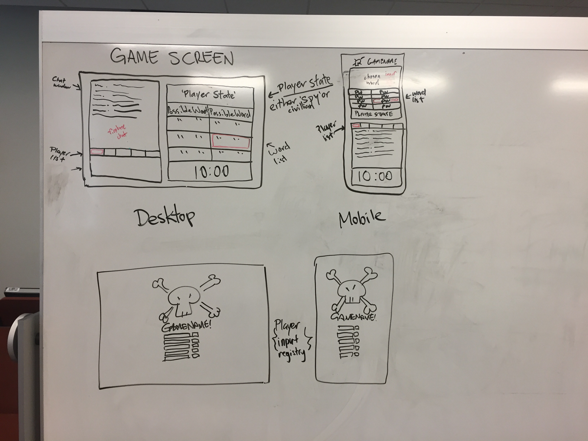

# Spyfall Online Project Proposal

## Team Members:
* Michael Gerov
* Asif Kabir
* Chris Houck
* Andrew Boe

## Project Description:
This project will be an online implementation of the popular board game Spyfall. Quoting the overview from the rulebook:

*"A game of Spyfall is made up of several short rounds. In each round the players find themselves  in a certain location with a specific role assigned  to each player. One player is always a spy who doesn’t know where they are. The spy’s mission is  to listen carefully, identify the location, and keep from blowing his cover. Each non-spy must give an oblique hint to the other non-spies sugges-ting that he knows the location’s identity, thus proving he’s not the spy. Observation, concentration, nonchalance, and cunning — you’ll need all of them in this game. Stay on your toes!"*

This game is traditionally placed face-to-face, but our implementation will use a chatroom feature to communicate amongst the players.

## Sketch:

## APIs:

This project will used Firebase Database for storing communicating game state and Firebase Auth will be used for account creation. Imgur API will be used to display images of the current location being played (e.g. Pirate Ship, Hospital, Theater, etc.).

## Major Tasks:

* Develop game logic in JS to control flow and state of the game
* Develop account creation and control with Firebase Auth
* Develop chat app to facilitate communication
* Develop UI that incorporates Imgur API
